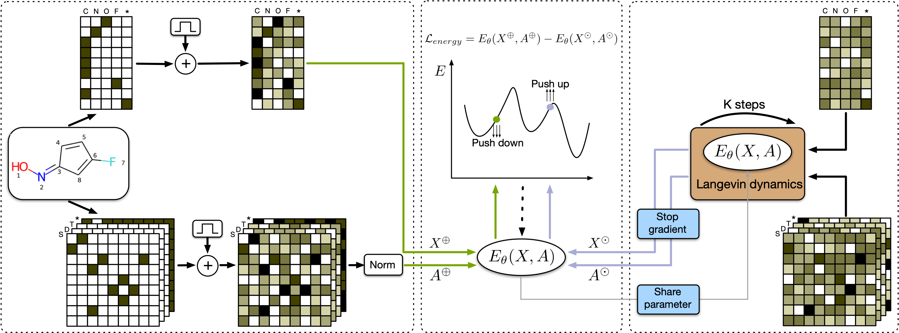

# GraphEBM

This is an official implementation for [GraphEBM: Molecular Graph Generation with Energy-Based Models](https://arxiv.org/abs/2102.00546).




### Examples

1. Random Generation: `randn_gen.ipynb`
1. Goal-Directed Generation: `goal-directed_gen.ipynb`
1. Compositional Generation: `compositional_gen.ipynb`


### Citation
```
@article{liu2021graphebm,
      title={{GraphEBM}: Molecular Graph Generation with Energy-Based Models}, 
      author={Meng Liu and Keqiang Yan and Bora Oztekin and Shuiwang Ji},
      journal={arXiv preprint arXiv:2102.00546},
      year={2021}
}
```

### Acknowledgement
Our implementation is based on [MoFlow](https://github.com/calvin-zcx/moflow) and [IGEBM](https://github.com/rosinality/igebm-pytorch). Thanks a lot for their awesome works.
