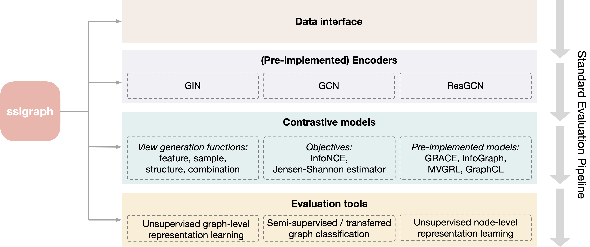

# Self-supervised Learning on Graphs

## Overview



The sslgraph package is a collection of benchmark datasets, data interfaces, evaluation tasks, and state-of-the-art algorithms for graph self-supervised learning. We aims to provide a *unified and highly customizable framework* for implementing graph self-supervised learning methods, *standardized datasets*, and *unified performance evaluation* for academic researchers interested in graph self-supervised learning. We cover the following three tasks:

1. **Unsupervised graph-level representation learning**, to learn graph-level representations on unlabeled graph dataset, evaluated by 10-fold linear classification with SVC or logistic regression;
1. **Semi-supervised graph classification (and any other two-stage training tasks including pre-training and finetuning on different datasets)**, that pretrain graph encoders with a large amount of unlabeled graphs, fintune and evaluate the encoder on a smaller amount of labeled graphs;
1. **Unsupervised node-level representation learning**, to learn node-level representation on unlabeled graph dataset evaluated by node-level linear classification with logistic regression.

## The Framework and Implemented Algorithms

The `sslraph` package implements a unified and highly customizable framework for contrastive learning methods as a parent class. Particular contrastive methods can be easily implemented given the framework by specifying its *encoder*, *functions for view generation*, and *contrastive objectives*.

Current version includes the following components and we will keep updating them as new methods come out.
- **Encoders**: GCN, GIN, and ResGCN (semi-supervised benchmark).
- **View functions**: unified node-induced sampling, random walk sampling (sample-based), node attribute masking (feature transformation), edge pertubation, graph diffusion (structure transformation) and their combinations or random choice.
- **Objectives**: InfoNCE (NT-XENT), Jenson-Shannon Estimator for all graph-level, node-level or combined contrast, and any number of views.

Based on the framework and components, four state-of-the-art graph generation algorithms are implemented, with detailed examples for running evaluations with the algorithms. The implemented algorithms include 
* `InfoGraph` (graph-level): [InfoGraph: Unsupervised and Semi-supervised Graph-Level Representation Learning via Mutual Information Maximization](https://arxiv.org/abs/1908.01000)
* `GRACE` (node-level): [Deep Graph Contrastive Representation Learning](https://arxiv.org/abs/2006.04131)
* `MVGRL` (graph & node): [Contrastive Multi-View Representation Learning on Graphs](https://arxiv.org/abs/2006.05582)
* `GraphCL` (graph-level): [Graph Contrastive Learning with Augmentations](https://arxiv.org/abs/2010.13902)

Alghouth only contrastive learning framework and methods are implemented, the evaluation tools are also compatible with predictive methods for self-supervised learning, such as graph auto-encoders.

## Environment requirements

- PyTorch >= 1.6.0
- PyTorch Geometric >= 1.6.1

## Package Usage

***We have provided examples for running the four pre-implemented algorithms with data interfaces and evaluation tasks. Please refer to the jupyter notebooks for instructions.***

Below are instructions to implement your own contrastive learning algorithms or perform evaluation with your own datasets.

### Evaluation on other datasets

All `Dataset` objects from `torch_geometric` are supported, such as `TuDataset` and `MoleculeNet` (see [the full list here](https://pytorch-geometric.readthedocs.io/en/latest/modules/datasets.html)). For new datasets that are not included, please refer to their [instructions](https://pytorch-geometric.readthedocs.io/en/latest/notes/create_dataset.html). For different evaluation tasks, the evaluator requires different dataset inputs.

* Unsupervised graph-level representation learning (`sslgraph.utils.eval_graph.EvalUnsupevised`) requires a single (unlabeled) dataset.

* Semi-supervised graph classification and transfer learning (`sslgraph.utils.eval_graph.EvalSemisupevised`) requires two datasets for model pretraining and finetuning respectively. The finetuning dataset must include graph labels.

* Unsupervised node-level representation learning (`sslgraph.utils.eval_node.EvalUnsupevised`) requires one dataset that includes all nodes in one graph, together with the training mask and test mask that indicates which ndoes are for training/test.

*Examples can be found in the jupyter notebooks.*

### Customize your own contrastive model

You can customize contrastive model using the base class `sslgraph.contrastive.model.Contrastive`. You will need to specify the following arguments.

```python
Contrastive(objective, views_fn, graph_level=True, node_level=False, z_dim=None, z_n_dim=None, 
            proj=None, proj_n=None, neg_by_crpt=False, tau=0.5, device=None, choice_model='last', 
            model_path='models')
```

* `objective`: String. Either `'NCE'` or `'JSE'`. The objective will be automatrically adjusted for different representation level (node, graph, or both).
* `views_fn`: List of functions. Each function corresponds to a view generation that takes graphs as input and outputs transformed graphs.
* `graph_level`, `node_level`: Boolean. At least one should be `True`. Whether to perform contrast among graph-level representations (GraphCL), node-level representations (GEACE), or both (DGI, InfoGraph, MVGRL). Default: `graph_level=True`, `node_level=False`.
* `z_dim`, `z_n_dim`: Integer or `None`. The dimension of graph-level and node-level representations. Required if `graph_level` or `node_level` is set to `True`, respectively. When jumping knowledge is applied in your graph encoder, `z_dim = z_n_dim * n_layers`.
* `proj`, `proj_n`: String, callable model, or `None`. The projection heads for graph/node-level representations. If string, should be either `'linear'` or `'MLP'`.
* `neg_by_crpt`: Boolean. Only required when using `JSE` objective. If `True`, model will generate corrupted graphs as negative samples. If `False`, model will consider any pairs of different samples in a batch as negative pairs.
* `tau`. Float in `(0,1]`. Only required when using `NCE` objective.

***Methods***:

```python
train(encoder, data_loader, optimizer, epochs, per_epoch_out=False)
```
* `encoder`: Pytorch `nn.Module` object or List of `nn.Module` object. Callable with input graphs, and returns graph-level, node-level, or both representations. If single object, the encoder will be shared by all views. If `List`, will use dedicated encoders for each view and the number of encoders should match the number of views.
* `data_loader`: Pytorch `Dataloader` object.
* `optimizer`: Pytorch optimizer. Should be initialized with the parameters in `encoder`. *Example*: `optimizer=Adam(encoder.parameters(), lr=0.001)`
* `epochs`: Integer. Number of pretraining epochs.
* `per_epoch_out`: Boolean. If `True`, yield encoder per epoch. Otherwise, only yield the final encoder at the last epoch.

    ***Return***: A generator that yields tuples of `(trained encoder, trained projection head)` at each epoch or after the last epoch. When only one of `graph_level` and `node_level` is `True`, the trained projection head only contains the corresponding head. When both are `True`, the trained projection head is a tuple of `(graph proj head, node proj head)`.

***You may also define a class using `Contrastive` and override the class methods (such as `train()`) as needed, so that the customized model can be used with the evaluation tools. Follow the examples for implementing [`GRACE`](sslgraph/contrastive/model/grace.py), [`InfoGraph`](sslgraph/contrastive/model/infograph.py), [`GraphCL`](sslgraph/contrastive/model/graphcl.py), and [`MVGRL`](sslgraph/contrastive/model/mvgrl.py).***


## Citation
If you find our library useful, please consider cite our work below.
```
@article{xie2021self,
  title={Self-Supervised Learning of Graph Neural Networks: A Unified Review},
  author={Xie, Yaochen and Xu, Zhao and and Zhang, Jingtun and Wang, Zhengyang and Ji, Shuiwang},
  journal={arXiv preprint arXiv:2102.10757},
  year={2021}
}
```

## Contact
*If you have any questions, please submit an issue or contact us at ethanycx@tamu.edu and sji@tamu.edu.*
