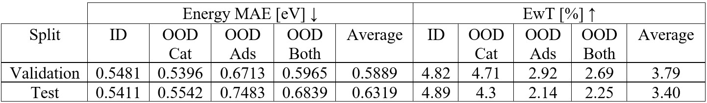

# ComENet: Towards Complete and Efficient Message Passing for 3D Molecular Graphs

Limei Wang, Yi Liu, Yuchao Lin, Haoran Liu, Shuiwang Ji

[paper](https://openreview.net/forum?id=mCzMqeWSFJ), [arxiv](https://arxiv.org/abs/2206.08515)

## Experiments
**Task.** The [Open Catalyst 2020 (OC20)](https://arxiv.org/abs/2010.09990) dataset includes three tasks, namely Structure to Energy and Forces (S2EF), Initial Structure to Relaxed Structure (IS2RS), and Initial Structure to Relaxed Energy (IS2RE). We focus on the IS2RE task, which is the most common task in catalysis as the relaxed energies are often correlated with catalyst activity and selectivity.

**Usage.** We use [the original OC20 framework](https://github.com/Open-Catalyst-Project/ocp) to train ComENet model. Please put file `comenet-ocp.py` and `utils.py` in a new directory `comenet` of `ocpmodels` directory, and put `comenet.yml` into the corresponding configs directory (e.g. https://github.com/Open-Catalyst-Project/ocp/tree/main/configs/is2re/all).

**Setting.** We use [**direct**](https://arxiv.org/abs/2010.09990) method in our paper without IS2RS auxiliary loss (e.g. [noisy nodes](https://openreview.net/forum?id=1wVvweK3oIb)). Specifically, during training, our model takes the initial structure as input, and the loss is the error between the predicted energy and the ground truth energy. During testing, our model takes an unseen structure as input and outputs the predicted energy.

**Training and inference time.** ComENet can be trained in under 20 minutes per epoch on a single Nvidia GeForce RTX 2080 Ti GPU. The total training time is less than 1 day, and predictions take less than one minute per test/validation split.

**Results.**
Here are the results.


**Trained model.** We also provided the model checkpoint (`IS2RETrainedModelWeights.pt`) in this folder.

## Citing

If you use ComENet in your work, please consider citing:

```bibtex
@inproceedings{
wang2022comenet,
title={Com{EN}et: Towards Complete and Efficient Message Passing for 3D Molecular Graphs},
author={Limei Wang and Yi Liu and Yuchao Lin and Haoran Liu and Shuiwang Ji},
booktitle={Advances in Neural Information Processing Systems},
year={2022}
}
```