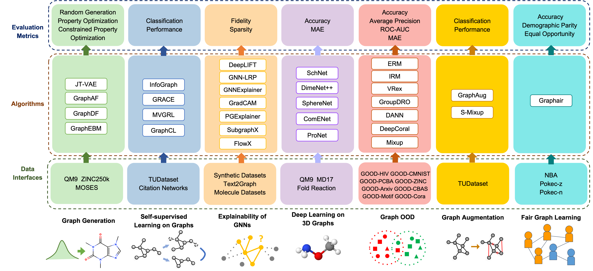

Introduction
============

DIG includes unified implementations of **data interfaces**, **common algorithms**, and **evaluation metrics** for several advanced tasks. Our goal is to enable researchers to easily implement and benchmark algorithms. Currently, we consider the following research directions.

* **Graph Augmentation**: :obj:`dig.auggraph`
* **Graph Generation**: :obj:`dig.ggraph`
* **Self-supervised Learning on Graphs**: :obj:`dig.sslgraph`
* **Explainability of Graph Neural Networks**: :obj:`dig.xgraph`
* **Deep Learning on 3D Graphs**: :obj:`dig.threedgraph`
* **Fair Graph Representations**: :obj:`dig.fairgraph`

We provide a hands-on tutorial for each direction to help you to get started with DIG: 

* `Tutorial for Graph Generation <https://diveintographs.readthedocs.io/en/latest/tutorials/graphdf.html>`_
* `Tutorial for Self-supervised Learning on Graphs <https://diveintographs.readthedocs.io/en/latest/tutorials/sslgraph.html>`_
* `Tutorial for Explainability of Graph Neural Networks <https://diveintographs.readthedocs.io/en/latest/tutorials/subgraphx.html>`_
* `Tutorial for Deep Learning on 3D Graphs <https://diveintographs.readthedocs.io/en/latest/tutorials/threedgraph.html>`_
* `Tutorial for Learning Fair Graph Representations <https://diveintographs.readthedocs.io/en/latest/tutorials/fairgraph.html>`_

You can also refer to our provided `examples <https://github.com/divelab/DIG/tree/dig/examples>`_ about how to use APIs in DIG.

   

   
   

   
   
