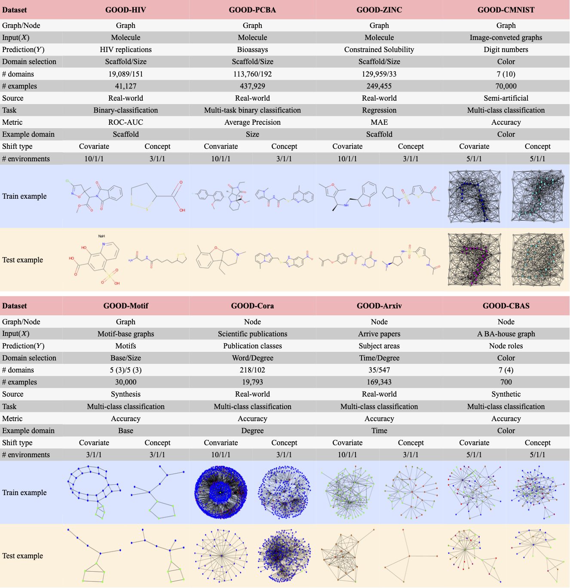

Tutorial for Graph OOD (GOOD)
=====================

This module includes datasets from `the GOOD project <https://github.com/divelab/GOOD>`_. **GOOD** (Graph OOD) is a graph out-of-distribution (OOD) algorithm benchmarking library depending on PyTorch and PyG
to make develop and benchmark OOD algorithms easily.

Currently, this module contains 8 datasets with 14 domain selections. When combined with covariate, concept, and no shifts, we obtain 42 different splits.
We provide `performance results <https://arxiv.org/pdf/2206.08452.pdf>`_ on 7 commonly used baseline methods (ERM, IRM, VREx, GroupDRO, Coral, DANN, Mixup) with 10 random runs.
This results in 294 dataset-model combinations in total. Our results show significant performance gaps between in-distribution and OOD settings.
This GOOD benchmark is a growing project and expects to expand in quantity and variety of resources as the area develops.

The dataset loading example can be directly found `here <https://github.com/divelab/DIG/blob/dig-stable/examples/oodgraph/good_datasets.ipynb>`_.