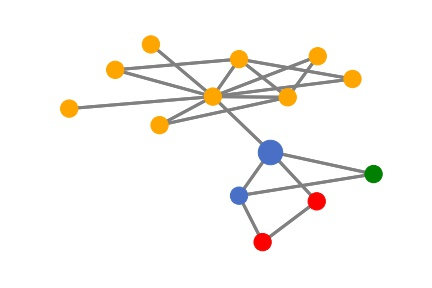
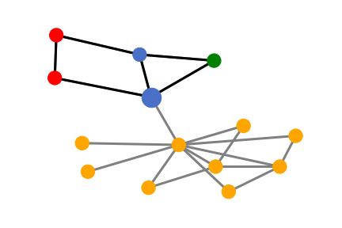

================================
Tutorial for GNN Explainability
================================

In this tutorial, we will show how to explain GNN models using our DIG library [1]_. Specifically, we show how to implement SubgraphX [2]_ to provide subgraph explanations to understand deep graph models. 

The Explainability of GNNs
===================================
Deep graph models are usually treated as black-boxes and lacking explainability. Without reasoning the prediction procedures of GNNs, we do not understand GNN models and do not know whether the models work in our expected way, thus preventing their use in critical applications pertaining to fairness, privacy, and safety. To demystify such black-boxes, we need to study the explainability of GNNs. 
Recently, several approaches are proposed to explain GNN models, such as XGNN [3]_, GNNExplainer [4]_, PGExplainer [5]_, and SubgraphX. 

To explain GNNs, we first need to know what type of explanations we need. If we need the general understanding and high-level insights of the GNNs, we may choose to study model-level explanations. Existing methods, such as XGNN, explain what graph patterns lead to a certain behavior of the model. In addition, if we need to study explanations for individual predictions, we need to choose instance-level methods, such as GNNExplainer, PGExplainer, and SubgraphX, etc. In addition, for instance-level methods, we may select different explanation targets, such as graph edges, nodes, walks, or subgraphs. 

* If we study graph nodes, we can use ZORRO [6]_, RelEx [7]_, and PGM-Explainer [8]_. 
* If we study graph edges, we can use GNNExplainer, PGExplainer, GraphMask [9]_, and Causal Screening [10]_.
* If we study graph walks, we can use GNN-LRP [11]_.
* If we study subgraphs, we can use SubgraphX. 

Once we decide what type of explanations and what explanation targets we need, we can start explaining deep graph models. Next, we will show how to use SubgraphX to provide subgraph explanations to explain deep graph models. 

Code Example
================ 
First, we load the dataset BA_shapes. It is a synthetic dataset built for the node classification task.  For each graph, it consists of a base Barabási-Albert graph (300 nodes) and a house-like five-node motif. Each node is labeled based on whether it belongs to the base graph or the different spatial locations of the motif.

.. code-block ::

    import torch
    import os.path as osp
    from dig.xgraph.dataset import SynGraphDataset
    device = torch.device('cuda:0' if torch.cuda.is_available() else 'cpu')
    dataset = SynGraphDataset('./datasets', 'BA_shapes')
    dataset.data.x = dataset.data.x.to(torch.float32)
    dataset.data.x = dataset.data.x[:, :1]
    dim_node = dataset.num_node_features
    dim_edge = dataset.num_edge_features
    num_classes = dataset.num_classes

Next, we load the trained GNN model. The model is trained using the BA_shapes dataset and we try to explain its predictions. Note that during the explanation stage, the target GNN model is fixed. 

.. code-block ::

    from dig.xgraph.utils.compatibility import compatible_state_dict

    def check_checkpoints(root='./'):
        if osp.exists(osp.join(root, 'checkpoints')):
            return
        url = ('https://github.com/divelab/DIG_storage/raw/main/xgraph/checkpoints.zip')
        path = download_url(url, root)
        extract_zip(path, root)
        os.unlink(path)
        
    from dig.xgraph.models import GCN_2l
    model = GCN_2l(model_level='node', dim_node=dim_node, dim_hidden=300, num_classes=num_classes)
    model.to(device)
    check_checkpoints()
    ckpt_path = osp.join('checkpoints', 'ba_shapes', 'GCN_2l', '0', 'GCN_2l_best.ckpt')
    state_dict = compatible_state_dict(torch.load(ckpt_path, map_location='cpu')['state_dict'])
    model.load_state_dict(state_dict)

Then given an input graph, we feed it to the GNN model and obtain the prediction for a target node.
Our goal is to explain what subgraph is important for the prediction of target node.
In this example, the prediction and label are both 2. Therefore, we are explaining a correct prediction.

.. code-block::

    data = dataset[0].to(device)
    node_indices = torch.where(dataset[0].test_mask * dataset[0].y != 0)[0].tolist()
    node_idx = node_indices[20]  # node_idx: 515
    logits = model(data.x, data.edge_index)
    prediction = logits[node_idx].argmax(dim=-1)
    # prediction class is 2, the middle node of the house motif

Since the graph model is a two-layer GNN model, the information only aggregates within 2-hops. Then for any node, its prediction is only determined by its 2-hop neighbors. Let's visualize the target node and its 2-hop neighbors as an illustration. Here the target node is the larger blue node and different colors denote different node labels. 

.. code-block::

    from dig.xgraph.method.subgraphx import PlotUtils
    from dig.xgraph.method.subgraphx import MCTS
    from torch_geometric.utils import to_networkx
    from torch_geometric.data import Data

    subgraph_x, subgraph_edge_index, subset, edge_mask, kwargs = \
        MCTS.__subgraph__(node_idx, data.x, data.edge_index, num_hops=2)
    subgraph_y = data.y[subset].to('cpu')
    new_node_idx = torch.argwhere(subset == node_idx)[0]
    
    vis_graph = to_networkx(Data(x=subgraph_x, edge_index=subgraph_edge_index))
    plotutils = PlotUtils(dataset_name='ba_shapes')
    plotutils.plot(vis_graph, nodelist=[], figname=None, y=subgraph_y, node_idx=new_node_idx)

Next, we use the SubgraphX method from our DIG library to explain this prediction. In SubgraphX, the target node and its 2-hop neighbors are considered as the computation graph. Then it uses the Monte Carlo Tree Search to explore different subgraphs. For each subgraph, the Shapley value is approximated to measure the importance. 

.. code-block::

    from dig.xgraph.method import SubgraphX
    explainer = SubgraphX(model, num_classes=4, device=device, explain_graph=False,
                            reward_method='nc_mc_l_shapley')

For more details of our DIG implementations, please refer to

* SubgraphX class :class:`~dig.xgraph.method.SubgraphX`.
 
* Monte Carlo Tree Search :class:`~dig.xgraph.method.MCTS`.

After MCTS searching and Shapley value computation, the subgraph with the highest importance score is selected as the explanation. Note that we can apply an upper bound on the size of the explanation so that the explanation succinct enough. Then we can show the visualization of the explanation results:

.. code-block::

    from dig.xgraph.method.subgraphx import find_closest_node_result
    plotutils = PlotUtils(dataset_name='ba_shapes')

    # Visualization
    max_nodes = 5
    node_idx = node_indices[20]
    print(f'explain graph node {node_idx}')
    data.to(device)
    logits = model(data.x, data.edge_index)
    prediction = logits[node_idx].argmax(-1).item()

    _, explanation_results, related_preds = \
        explainer(data.x, data.edge_index, node_idx=node_idx, max_nodes=max_nodes)
    result = find_closest_node_result(explanation_results[prediction], max_nodes=max_nodes)

    plotutils = PlotUtils(dataset_name='ba_shapes')
    explainer.visualization(explanation_results[prediction],
                            max_nodes=max_nodes,
                            plot_utils=plotutils,
                            y=data.y)

Obviously, the SubgraphX successfully and precisely identifies the house-like motif as the important subgraph for the target blue node's prediction. It is consistent with the rule we build the dataset. 

Furthermore, we can quantitatively evaluate the explanation. Specifically, we use the fidelity metric and sparsity metric, which are supported by our DIG library. The fidelity metric measures the difference between predictions by occluding the important subgraph from the original graph while the sparsity metric measures the size of the explanation. Here we show the fidelity and sparsity of the above explanation.

.. code-block::

    max_nodes = 5
    node_idx = node_indices[20]
    _, explanation_results, related_preds = \
        explainer(data.x, data.edge_index, node_idx=node_idx, max_nodes=max_nodes)
    result = find_closest_node_result(explanation_results[prediction], max_nodes=max_nodes)
    related_preds[prediction]

Results:
fidelity: 0.1384, sparsity: 0.6429

.. [1] Liu, M., Luo, Y., Wang, L., Xie, Y., Yuan, H., Gui, S., Yu, H., Xu, Z., Zhang, J., Liu, Y. and Yan, K., 2021. DIG: A Turnkey Library for Diving into Graph Deep Learning Research. arXiv preprint arXiv:2103.12608.
.. [2] Yuan, H., Yu, H., Wang, J., Li, K. and Ji, S., 2021. On explainability of graph neural networks via subgraph explorations. In the 38th International Conference on Machine Learning, 2021.
.. [3] Yuan, H., Tang, J., Hu, X. and Ji, S., 2020, August. Xgnn: Towards model-level explanations of graph neural networks. In Proceedings of the 26th ACM SIGKDD International Conference on Knowledge Discovery & Data Mining (pp. 430-438).
.. [4] Ying, R., Bourgeois, D., You, J., Zitnik, M. and Leskovec, J., 2019. Gnnexplainer: Generating explanations for graph neural networks. Advances in neural information processing systems, 32, p.9240.
.. [5] Luo, D., Cheng, W., Xu, D., Yu, W., Zong, B., Chen, H. and Zhang, X., 2020. Parameterized explainer for graph neural network. arXiv preprint arXiv:2011.04573.
.. [6] Funke, T., Khosla, M. and Anand, A., 2020. Hard Masking for Explaining Graph Neural Networks, 2020.
.. [7] Zhang, Y., Defazio, D. and Ramesh, A., 2020. Relex: A model-agnostic relational model explainer. arXiv preprint arXiv:2006.00305.
.. [8] Vu, M.N. and Thai, M.T., 2020. Pgm-explainer: Probabilistic graphical model explanations for graph neural networks. arXiv preprint arXiv:2010.05788.
.. [9] Schlichtkrull, M.S., De Cao, N. and Titov, I., 2020. Interpreting graph neural networks for nlp with differentiable edge masking. arXiv preprint arXiv:2010.00577.
.. [10] Wang, X., Wu, Y., Zhang, A., He, X. and Chua, T.S., 2020. Causal Screening to Interpret Graph Neural Networks. 2020.
.. [11] Schnake, T., Eberle, O., Lederer, J., Nakajima, S., Schütt, K.T., Müller, K.R. and Montavon, G., 2020. Higher-order explanations of graph neural networks via relevant walks. arXiv: 2006.03589.
