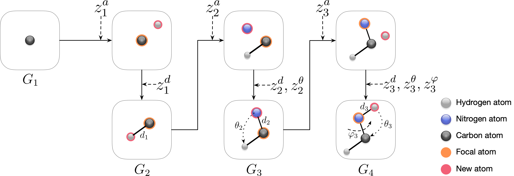

# G-SphereNet

This is the official implementation for [An Autoregressive Flow Model for 3D Molecular Geometry Generation from Scratch](https://openreview.net/forum?id=C03Ajc-NS5W).



## Usage

### Random Generation

You can use our trained models or train the model from scratch:
```shell script
$ cd examples/ggraph3D/G_SphereNet
$ CUDA_VISIBLE_DEVICES=${your_gpu_id} python run_rand_gen.py --train
```
To generate molecular geometries using our trained model and evaluate the performance, first download models from [this link](https://github.com/divelab/DIG_storage/tree/main/ggraph3D/G-SphereNet), then:
```shell script
$ cd examples/ggraph3D/G_SphereNet
$ CUDA_VISIBLE_DEVICES=${your_gpu_id} python run_rand_gen.py --num_mols=1000 --model_path=${path_to_the_model}
```

Note that the chemical validity results on our paper are tested with rdkit version of [2020.03.3.0](https://anaconda.org/mjohnson541/rdkit). However, running the pip installation command of the dig package will automatically install the latest rdkit package, in which case you may get a lower chemical validity on molecular geometries generated by our trained model.

### Targeted Molecule Discovery

For targeted molecule discovery, we aim to generate molecular s with desirable properties (*i.e.*, low HOMO-LUMO gap or high isotropic polarizability in this work). You can use our trained models or train the model from scratch:
```shell script
$ cd examples/ggraph3D/G_SphereNet
$ CUDA_VISIBLE_DEVICES=${your_gpu_id} python run_prop_opt.py --train --prop=gap
$ CUDA_VISIBLE_DEVICES=${your_gpu_id} python run_prop_opt.py --train --prop=alpha
```

To generate molecules using our trained model and evaluate the performance, first download models from [this link](https://github.com/divelab/DIG_storage/tree/main/ggraph3D/G-SphereNet), then:
```shell script
$ cd example/ggraph3D/G_SphereNet
$ CUDA_VISIBLE_DEVICES=${your_gpu_id} python run_prop_opt.py --num_mols=100 --model_path=${path_to_the_model} --prop=gap
$ CUDA_VISIBLE_DEVICES=${your_gpu_id} python run_prop_opt.py --num_mols=100 --model_path=${path_to_the_model} --prop=alpha
```

### Citation
```
@inproceedings{
  luo2022an,
  title={An Autoregressive Flow Model for 3D Molecular Geometry Generation from Scratch},
  author={Youzhi Luo and Shuiwang Ji},
  booktitle={International Conference on Learning Representations},
  year={2022},
  url={https://openreview.net/forum?id=C03Ajc-NS5W}
}
```
