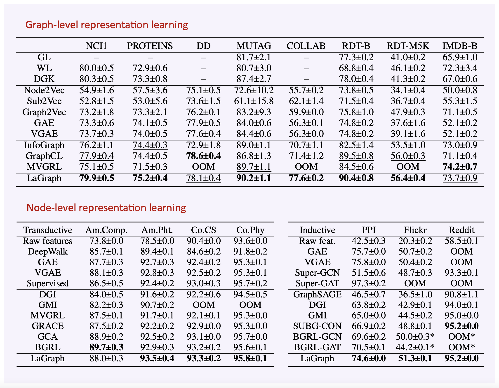
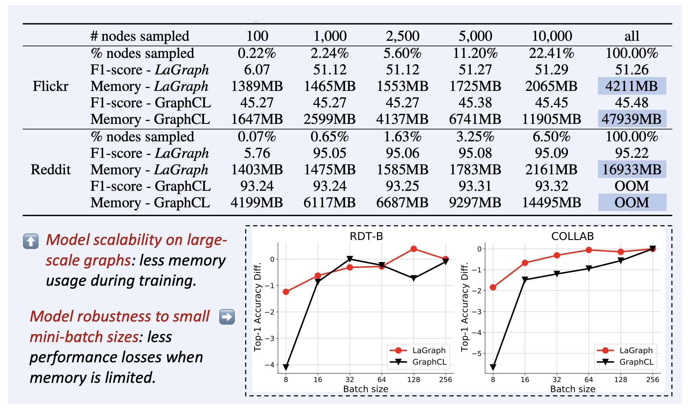

# Self-Supervised Representation Learning via Latent Graph Prediction

PyTorch implementation for [Self-Supervised Representation Learning via Latent Graph Prediction](https://arxiv.org/abs/2202.08333)

Yaochen Xie<sup>\*</sup>, Zhao Xu<sup>\*</sup>, Shuiwang Ji

In ICML 2022.

## Overview

Self-supervised learning (SSL) of graph neural networks is emerging as a promising way of leveraging unlabeled data. 
Currently, most methods are based on contrastive learning adapted from the image domain, which requires view generation and a sufficient number of negative samples. 
In contrast, existing predictive models do not require negative sampling, but lack theoretical guidance on the design of pretext training tasks. 
In this work, we propose the *LaGraph*, a theoretically grounded predictive SSL framework based on latent graph prediction. 
Learning objectives of *LaGraph* are derived as self-supervised upper bounds to objectives for predicting unobserved latent graphs. 
In addition to its improved performance, *LaGraph* provides explanations for recent successes of predictive models that include invariance-based objectives. 
We provide theoretical analysis comparing *LaGraph* to related methods in different domains. 
Our experimental results demonstrate the superiority of *LaGraph* in performance and the robustness to the decreasing training sample size on both graph-level and node-level tasks.






## Experiments

To reproduce experimental results of graph-level tasks, please refer to ```graph/example.ipynb```.
To reproduce experimental results of node-level tasks, please refer to ```node/example.ipynb```.

## Citation

If you use this code for you research, please cite our paper.

```
@article{xie2022self,
  title={Self-Supervised Representation Learning via Latent Graph Prediction},
  author={Xie, Yaochen and Xu, Zhao and Ji, Shuiwang},
  journal={arXiv preprint arXiv:2202.08333},
  year={2022}
}
```